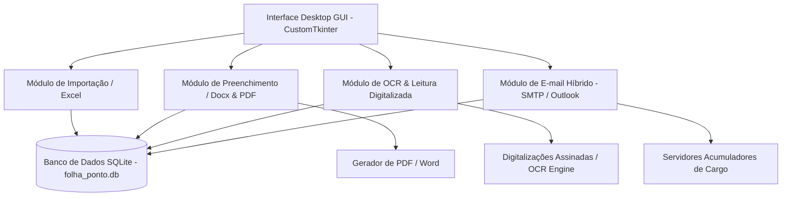

# Plano de Implementação: Sistema de Gestão de Folhas de Ponto — DIGEP (UnDF)

Este documento detalha o plano de desenvolvimento do sistema desktop em Python para automação do fluxo mensal de folhas de ponto na DIGEP (Universidade do Distrito Federal).

---

## 🏗️ Arquitetura do Sistema

---

## 📋 Funcionalidades Principais & Requisitos (RF01 - RF12)

1. **Gestão e Importação de Servidores (RF01)**:
   - Importação via planilha Excel (`Planilha de professores - exemplo.xlsx`).
   - Leitura dos campos: Nome, Matrícula, E-mail, Carga Horária, CPF, Acumula Cargo (Sim/Não), Cargo, Função, UA, Exercício, Padrão.
   - Armazenamento estruturado no SQLite local.

2. **Geração e Preenchimento das Folhas de Ponto (RF06, RF08)**:
   - Leitura do arquivo modelo `.docx` (`Modelo de folha de ponto - Exemplo.docx`).
   - Substituição precisa das tags/campos no documento Word sem quebrar a formatação da tabela.
   - Exportação automática de PDFs individuais por servidor e competência (mês/ano).

3. **Processamento OCR & Upload em Lote de Digitalizações (RF02, RF03, RF04, RF05)**:
   - Upload de múltiplos arquivos digitalizados (PDFs ou imagens).
   - Extração automática via OCR (Tesseract / EasyOCR / PyMuPDF) da matrícula, nome e competência.
   - Associação automática folha ↔ servidor ↔ competência no SQLite.
   - Tela de conferência visual para validar/corrigir leituras ilegíveis.

4. **Identificação e Distribução de Servidores Acumuladores (RF09, RF10, RF11, RF12)**:
   - Filtro de servidores com acúmulo de cargo.
   - Envio de e-mail automatizado (suporte a SMTP e Microsoft Outlook local).
   - Rastreamento completo com log de auditoria: *Pendente*, *Enviado*, *Erro*.

5. **Empacotamento Executável (.exe)**:
   - Script de build com PyInstaller para compilar a aplicação inteira em um arquivo `.exe` portátil único para usuários leigos.

---

## 🛠️ Fases de Desenvolvimento

### Fase 1: Preparação do Ambiente & Banco de Dados
- Instalar dependências necessárias: `customtkinter`, `python-docx`, `openpyxl`, `pytesseract`, `pymupdf`, `pywin32`, `pillow`, `pyinstaller`.
- Criar a estrutura do banco de dados `sqlite3` (`db.py` / `models.py`) com tabelas de `servidores`, `folhas_geradas`, `folhas_digitalizadas`, `logs_envio`.

### Fase 2: Módulo Core (Excel, Word & PDF)
- Desenvolver `excel_service.py` para parsear planilhas Excel.
- Desenvolver `docx_service.py` para preencher tabelas e parágrafos do modelo `.docx`.
- Desenvolver `pdf_service.py` para converter os documentos preenchidos em PDF (via Word COM / LibreOffice / fitz).

### Fase 3: Módulo OCR & Leitura Digitalizada
- Desenvolver `ocr_service.py` utilizando tratamento de imagem (PIL/OpenCV) e extração de padrões via Regex (Matrícula, Nome, Competência).
- Criar rotina de associação inteligente no banco de dados.

### Fase 4: Módulo de Envio de E-mail (SMTP / Outlook)
- Desenvolver `email_service.py` com suporte duplo:
  1. Envio via SMTP (host, porta, SSL/TLS, usuário, senha).
  2. Envio via win32com (Outlook Desktop).
- Gravação de logs detalhados de auditoria.

### Fase 5: Interface Gráfica GUI (CustomTkinter)
- Criar janela principal modular com abas:
  - 📥 **Importar / Servidores**: Carregar Excel e gerenciar cadastros.
  - 📄 **Gerar Folhas**: Selecionar competência e preencher modelos em PDF.
  - 🔍 **OCR / Digitalizações**: Upload em lote e associação de folhas assinadas.
  - ✉️ **Envio para Acumuladores**: Envio de e-mails com status e filtros.
  - 📊 **Consultas & Auditoria**: Busca por servidor, matrícula e histórico.
  - ⚙️ **Configurações**: Parâmetros SMTP/Outlook e diretórios.

### Fase 6: Testes, Verificação & Geração do Executável (.exe)
- Testar geração de folhas a partir dos arquivos de exemplo existentes.
- Executar testes de OCR e verificação de integridade dos arquivos.
- Compilar arquivo `.exe` único via PyInstaller e testar execução.
